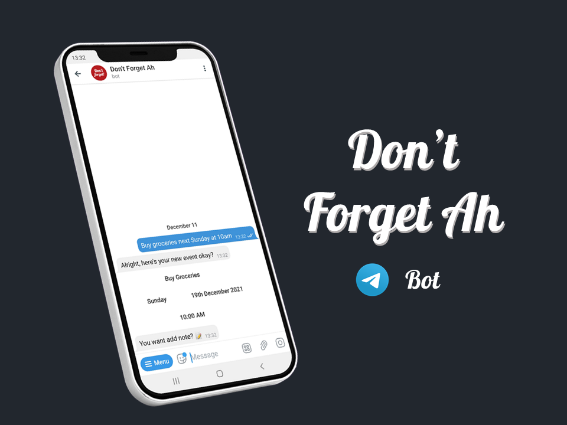
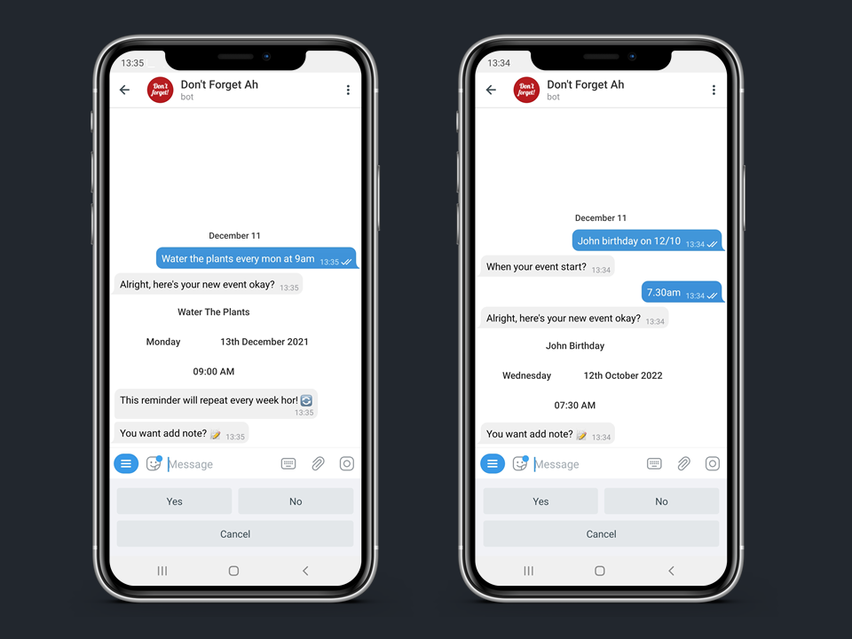
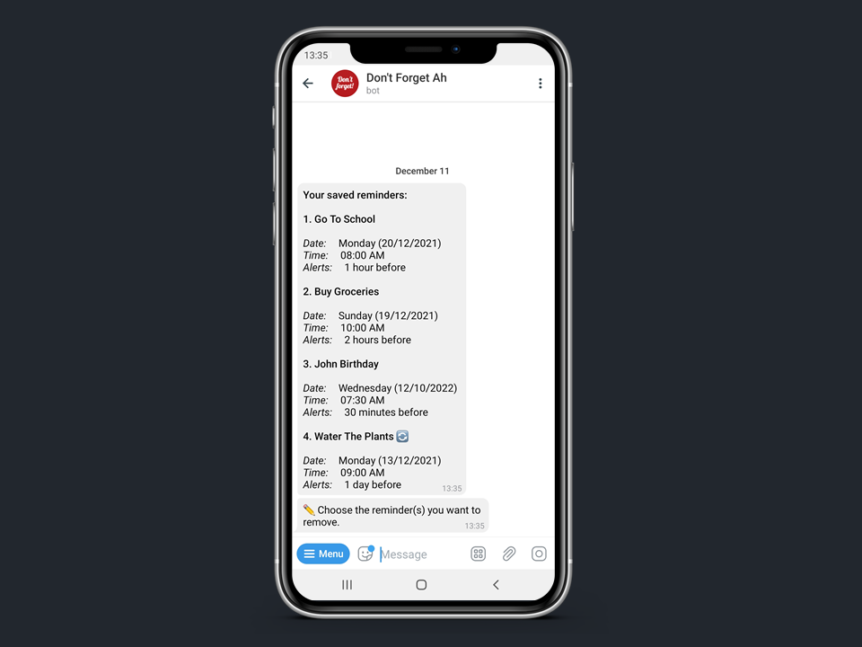

# DontForgetAh Bot

An easy-to-use Telegram bot which uses natural language processing to schedule events and appointments, with a unique Singaporean twist. Built with Python NLTK.

<br />
<div align="center">
  <a href="https://github.com/nicleejy/DontForgetAh-Bot">
    
  </a>

  <p align="center">
    <br />
    <a href="https://telegram.me/DontForgetAhBot"><strong>@DontForgetAhBot</strong></a>
    <br />
    <a href="https://github.com/nicleejy//DontForgetAh-Bot/issues">Report Bug</a>
    ·
    <a href="https://github.com/nicleejy//DontForgetAh-Bot/issues">Request Feature</a>
  </p>
</div>

# About
Built using the Natural Language Toolkit, Don'tForgetAh is a scheduler bot that is able to recognise text messages and schedule appointments accordingly. 
The bot is uniquely catered towards Singaporean users and will give instructions or prompts in Singlish, with the default timezone set to GMT+8.<br/><br/>

<p align="center">

</p><br/><br/>

## Project Details
The following is a demonstration of how user input is processed with the help of NLTK. 
```
$ pip install nltk
```
```python
import nltk
from nltk.tokenize import word_tokenize
```

<br/><br/>Given input from the user, we first use tokenisation to split up the words for analysis.
```python
input = "remind me to go to work at 8am next mon"
tokenised_input = word_tokenize(text=input)
tokenised_input: ['remind', 'me', 'to', 'go', 'to', 'work', 'at', '8am', 'next', 'mon']
```
<br/><br/>Next, perform POS Tagging (Part of Speech) to categorise and label the parts of speech each word belongs to in the sentence. This will help in the separation of the event title from the rest of the details.
```python
tagged = nltk.pos_tag(tokenised_input)
tagged:  [('remind', 'VB'), ('me', 'PRP'), ('to', 'TO'), ('go', 'VB'), ('to', 'TO'), ('work', 'VB'), ('at', 'IN'), ('8am', 'CD'), ('next', 'JJ'), ('mon', 'NN')]
```
<br/><br/>The following procedure is neither foolproof nor flawless, but it does the job well enough in most ordinary use cases.
If a single verb ('VB') appears in the sentence, the program classifies this as part of the event title. 
If verbs appear more than 2 times, the first verb is regarded as redundant and not considered part of the event title. 
In this case, the text is indexed from 'go' and sliced. 
The program will then identify prepositions ('IN') or cardinal digits ('CD') that indicate the end of the event title.
A list of stop words is predeclared, which it checks against to see if any time-related keywords such as 'next', 'tmr', 'tues' appear in the list and indexed accordingly.
The text is then sliced at this index to obtain the event title. The remaining set of words contain the details critical for time setting.

Another set of functions look out for the format of the user input and classifies each word as a 'time', 'day', 'date', 'month', 'year' entry.
Timings can be specified in a number of ways, including both 12-hour and 24-hour formats, with dots or colons (eg. 6.30pm, 9:00am) and with extensions 'am' or 'pm'.
Similarly, date entries can be specified as 'mon', '8th' or even '8/2'. Short forms of months or days are also stored in predeclared dictionaries
so that they can be identified correctly. Any missing entries in the initial rounds returns a value for a specific prompt, while errors raised are also classified to provide feedback to
the user. Any new details specified are updated and stored with each subsequent 'poll'. This way, earlier inputs still persist in memory.

Some causes which result in prompts include:
- Incorrect time format
- Incorrect month/day range
- A date or time which is in the past
- Missing time info
- Missing date info

## Assumptions

When a time is provided without a day, the bot checks to see if the time is still applicable for the current day. 
If the stated time has already passed, the reminder time will be automatically offset to the next day. If a date is specified without a month (eg '10th'), the default month will be the current month, else if the date has already passed, the reminder time will be offset to the next month.
Similarly, the default year of the reminder is set to the present year and will be offset if necessary.

# Bot Interface

The user interface for this bot was designed to be as clean and intuitive as possible.

## Creating Appointments
<p align="center">

</p><br/><br/>
<p align="right">(<a href="#top">back to top</a>)</p>

## Editing Reminders
<p align="right">(<a href="#top">back to top</a>)</p>
<p align="center">

</p><br/><br/>

# Commands
1. `/start` - Bring up main menu
2. `/help` - Bring up help menu

<p align="right">(<a href="#top">back to top</a>)</p>

# Tech Stack
* [Natural Language Toolkit (NLTK)](https://www.nltk.org/)
* [MongoDB Atlas](https://www.mongodb.com/atlas/database)
* [Heroku](https://www.heroku.com)
* [APScheduler](https://pypi.org/project/APScheduler/2.1.2/)
* [pyTelegramBotAPI](https://github.com/eternnoir/pyTelegramBotAPI)

<p align="right">(<a href="#top">back to top</a>)</p>

## Try the Bot

https://telegram.me/DontForgetAhBot

## Requirements
To install the main package for the Telegram Bot API:

```$ pip install pyTelegramBotAPI```

* Installation from source (requires git):

```
$ git clone https://github.com/eternnoir/pyTelegramBotAPI.git
$ cd pyTelegramBotAPI
$ python setup.py install
```

Install other packages and drivers (APScheduler, Pymongo):

```$ pip install -r requirements.txt```

# Contributing

Any contributions you make are greatly appreciated!

If you have a suggestion that would make this better, please fork the repo and create a pull request.

<p align="right">(<a href="#top">back to top</a>)</p>


# License

Distributed under the MIT License. See `LICENSE.txt` for more information.

<p align="right">(<a href="#top">back to top</a>)</p>

# Support
Contributions, issues, and feature requests are welcome!
- Give a ⭐️ if you like this project! 


<!-- CONTACT -->
# Contact

Nicholas Lee: nic.leejunyi@gmail.com

Project Link: [https://github.com/nicleejy/NUS-Timetable-Reminders](https://github.com/nicleejy/NUS-Timetable-Reminders)

<p align="right">(<a href="#top">back to top</a>)</p>


